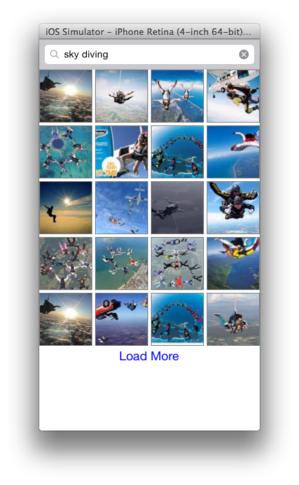

GLGoogleImageSearch
===================


A image search for iOS using Google.

### Sample project
The pod dependencies are not being versioned, so before running the project be sure to call:
```
pod install
```

Note: Replace the value of 'kGoogleAPIKey' with your Google API key in GLGoogleImageSearch.m

### License
http://gautam.mit-license.org/